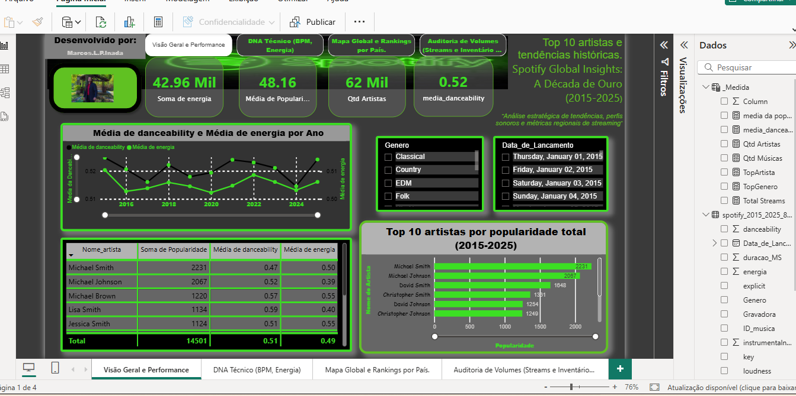
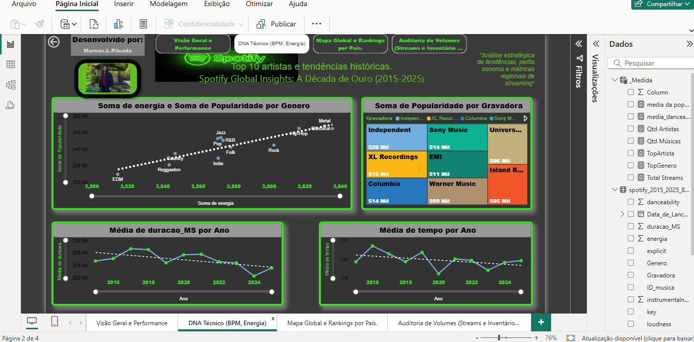
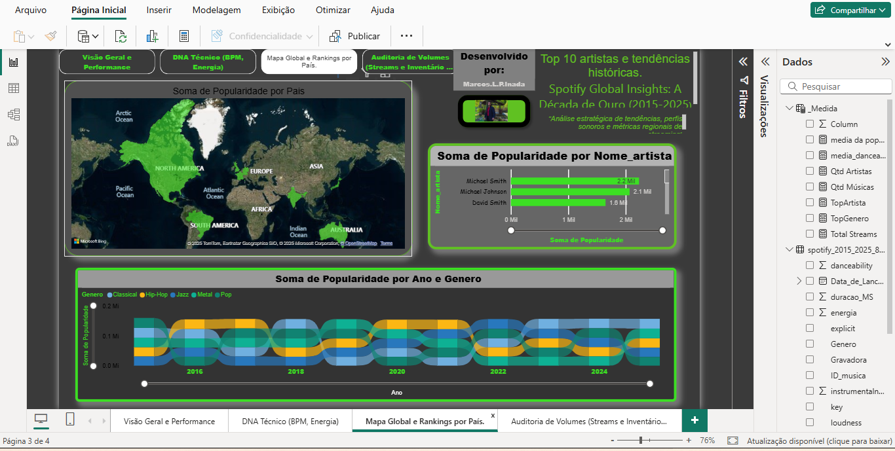
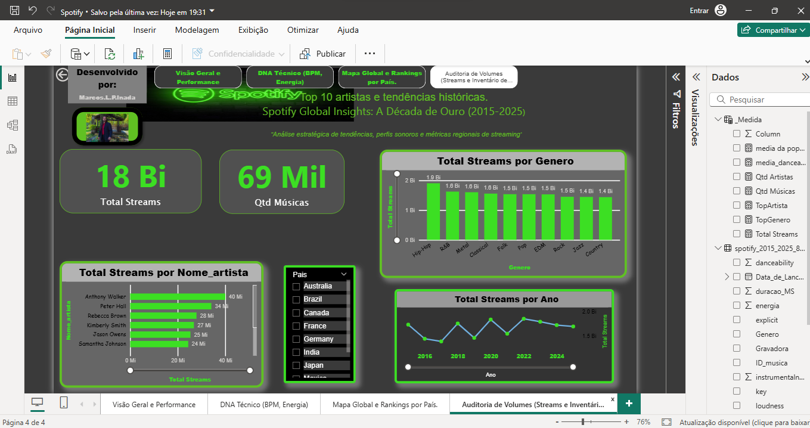

# decade-of-music-analytics
Dashboard interativo no Power BI para análise estratégica de tendências, perfis sonoros e métricas globais de streaming do Spotify (2015-2025).  

 # Spotify Global Insights: A Década de Ouro (2015-2025) 
 ###### Visão Geral
Este dashboard interativo foi desenvolvido para analisar as tendências do mercado musical global no Spotify ao longo da última década. O projeto foca em identificar como características técnicas (BPM, Energia, Dançabilidade) influenciam a popularidade dos artistas e a evolução dos gêneros musicais.

###### Objetivo: Analisar a correlação entre métricas sonoras e sucesso de mercado.
Público-alvo: Produtores musicais, Executivos de Gravadoras e Analistas de Mercado.
Fonte de Dados: Dados fictícios extraídos da plataforma Kaggle, simulando um cenário real de Big Data.
 
 
#  Imagem do projeto: 

 

# Estrutura do Dashboard
O relatório está dividido em 4 visões complementares:
Visão Geral e Performance: KPIs de popularidade e ranking dos Top 10 artistas.
DNA Técnico da Música: Análise de correlação entre métricas sonoras (Energia, BPM, Danceability) e sucesso de mercado.
Análise Geográfica e Temporal: Mapa global de popularidade e evolução dos gêneros através do Ribbon Chart.
Auditoria de Volumes: Visão técnica do inventário, totalizando 18 bilhões de streams e 69 mil músicas.
________________________________________
# Insights Estratégicos por Página

## Página 1: Visão Geral e Performance
Estabilidade Sonora: A análise revelou uma forte correlação entre Danceability e Energia. Apesar de oscilações anuais, o mercado favorece músicas que equilibram ritmo e intensidade de forma constante.
Divergência de Perfil nos Top Artistas: Os líderes de popularidade, Michael Smith e Michael Johnson, desafiam a média global. Smith prioriza Energia (0.50), enquanto Johnson domina com alta Dançabilidade (0.52) e energia reduzida (0.39), provando que diferentes nichos coexistem no topo.
Polarização de Liderança: Os dois líderes isolados sustentam um desempenho quase 50% superior à média dos outros integrantes do Top 10, indicando uma base de fãs extremamente fiel ou alta eficiência na produção de hits.

## Página 2: DNA Técnico (BPM, Energia e Mercado)  
Fórmula do Sucesso: O gráfico de dispersão prova que gêneros com maior carga de Energia tendem a alcançar níveis mais altos de Popularidade. Metal e Hip-Hop destacam-se nesse quadrante
de alto engajamento.
Competitividade de Gravadoras: O Treemap revela um mercado equilibrado, onde artistas independentes competem em pé de igualdade com grandes selos como Sony Music e Universal.
Redução no Tempo de Atenção: A tendência descendente na duração média das faixas sugere uma adaptação da indústria aos algoritmos de retenção das redes sociais.
## Página 3: Mapa Global e Tendências Regionais
Geografia do Consumo: A América do Norte é o principal motor de popularidade, seguida por mercados estratégicos na Europa e Austrália.
Fluidez dos Gêneros (Ribbon Chart): Identificou-se alta volatilidade e "dança das cadeiras" entre Pop, Hip-Hop e Metal, provando que a preferência do público é cíclica e dinâmica.
## Página 4: Auditoria de Volumes e Inventário	Escala de Dados:
Com 18 bilhões de streams e 69 mil faixas, o projeto possui uma base estatística robusta para as tendências apresentadas.
Motor de Engajamento: O Hip-Hop consolidou-se como o líder em volume bruto, gerando sozinho 1.9 bilhões de reproduções.
# Origem dos Dados
Os dados utilizados neste projeto são de caráter fictício e foram extraídos da plataforma Kaggle. O conjunto de dados foi selecionado para simular um cenário real de streaming global, permitindo a exploração de grandes volumes de informações (Big Data) e a aplicação de técnicas avançadas de BI.

# Tecnologias e Ferramentas
Power BI: Utilizado para processamento, modelagem de dados e criação do dashboard interativo.
Linguagem DAX: Aplicada para a criação de medidas personalizadas e cálculos de performance.
Power Query: Utilizado para a limpeza, transformação e normalização dos dados brutos (ETL).
Design de UI/UX: Implementação de tema Dark Mode com estética neon, otimizando a legibilidade e a experiência do usuário.

✍️ Autor
Marcos Inada   
LinkedIn: [ https://www.linkedin.com/in/marcosinada/ ]

E-mail: marcoscorleone1985@gmail.com

Analista de Dados | Power BI | Insights de Mercado

LinkedIn: [https://www.linkedin.com/in/marcosinada/]

E-mail: marcoscorleone1985@gmail.com

